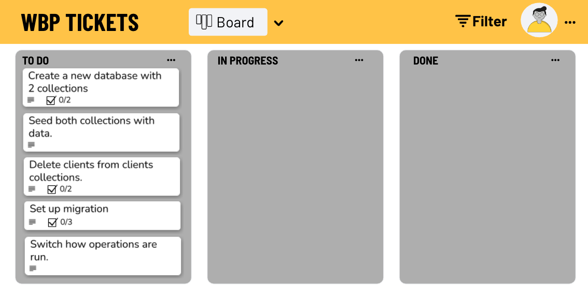

# Promises


Your 30-yr old company has been having issues with backing up its client database which is in excess of 1TB. Consequently the backups take several hours because the vast majority of the time spent backing up clients is spent combing through old clients that haven't changed in decades. The company's solution is to separate the old from the current collection of clients. The old clients collection will be backed up in parallel with the current clients collection, so that backups of the relatively small number of current clients, can process quickly while the collection of old clients can proceed for a longer time, without hindering how long it takes to backup the current clients.

---


1. Create a new database and two new collections within this database
1. Seed both collections with the data in `data.js`
    - do this using promises so that the seed operations happen either sequentially or in parallel
1. Delete any current clients from the old clients collection, and delete any old clients from the current clients collection
1. Set up your migration script so that it does the following each time you run it:
   - clears out any data in the old clients/current clients collections
   - seeds the data from `data.js` (this you've already written)
   - deletes the appropriate clients from the collections (this you've already written)
1. Switch how operations are run.  If they ran sequentially, they should now run in parallel.  If they ran in parallel, they should now run sequentially.  Compare how long the migration script runs now with how it previously ran.  If necessary, add more data until you see a difference.

---


<!-- [Trello Board](https://trello.com/b/ZKeYDj7x/promises) -->



---


#### Step 1:

Fork and clone this repo.
The company has exported its current client list into `data.js`.  Your job is to write a "migration" script (just a `.js` file run via node) that will:

1. create a new database for this exercise
1. create two new collections within the database (one for old clients and one for new clients)
1. seed both collections with the data in `data.js`
    - do this using promises so that the seed operations happen either sequentially or in parallel

Watch out!  Unless you write your code perfectly the first time, there's a really good chance you'll seed your collections more than once and have duplicate data.  If this happens, the easiest thing to do is probably to delete the data manually via `mongosh`.

#### Step 2 (Stretch Goal):

You now have two collections with the same data in them.  We want the old clients collection to only contain clients that have the `stillClient` property set to `false`, while the current clients collection should only contain clients that have the `stillClient` property set to `true`.

Set up two delete operations in your migration script that will:

- delete any current clients from the old clients collection
- delete any old clients from the current clients collection

Don't forget to comment out your seed code, otherwise you'll duplicate the data in your collection every time your run the script.

If your seed operations ran sequentially, have the delete operations run sequentially.  If your seed operations ran in parallel, have the delete operations run in parallel.  You'll swap both processes to sequential/parallel later.

**NOTE** You'll notice that the number of old clients is pretty much the same as new clients.  This is just a result of how this data was generated.  Let's just pretend that there are many more old clients than new clients.

#### Step 3 (Stretch Goal):

Set up your migration script so that it does the following each time you run it:

1. clears out any data in the old clients/current clients collections
1. seeds the data from `data.js` (this you've already written)
1. deletes the appropriate clients from the collections (this you've already written)

This means you'll need to set up delete routes at the beginning of your script to clear out any previous data that was in there from the last time the script was run.  The end result is that you can run this script multiple times, and the data (aside from ids) will be the same in the collections each time.

Again, if your previous code ran sequentially, run this code sequentially.  If your previous code ran in parallel, run this code in parallel.

#### Step 4 (Stretch Goal):

If you had the processes run in sequence, modify the code so that they happen in parallel.  If they ran in parallel, run them in sequence.  See if you notice a difference between how long sequential takes vs. parallel.  You might not notice a difference, which means you have a fast computer.  Modify `faker.js` so that it generates more clients.  You can run `npm i` to install the `faker` package and then run:

```node faker.js > data.js```

to direct the output of node into data.js.  Just remember to add `exports.clients =` to the beginning of `data.js` before you run any imports/deletes.
